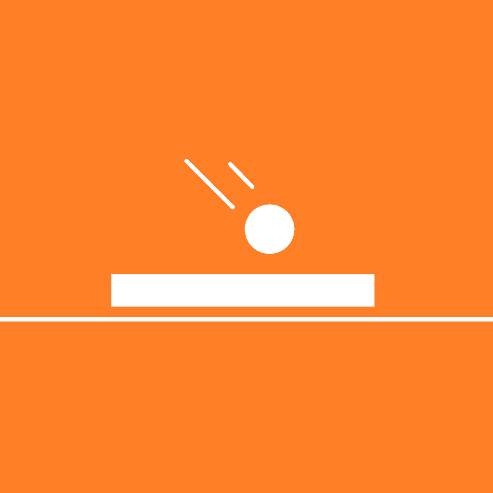

    

    
    
     
     

<h1 align="center">Watch Bash</h1>

🕹️ A game for WearOS made with Flutter and Flame.

  
  

## About

Inspired by @renancaraujo's [Watchsteroids](https://github.com/renancaraujo/watchsteroids), I decided to make my own WearOS game with Flutter and Flame. The result was "Watch Bash", a very minimalist 2D version of the first minigame in the PS1 classic "Crash Bash".

You can use both the touch screen and the rotating bezel to control the player. The game is very simple, you just need to score 15 points on all the opponents before they do it on you. It gets harder towards the end when the goals of defeated opponents turn into walls, making more balls to stay in the game. As always, suggestions and PRs are welcome!

## Support my work

If you like this and/or [other things I've made](https://kylekun.com/work), consider [becoming a sponsor](https://github.com/sponsors/KyleKun). It will allow me to stay motivated to work on open source projects.

Alternatively, you can [buy me a coffee](https://www.buymeacoffee.com/kylekun).
